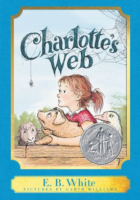

#readability

According to Scholastic, E.B. White’s Charlotte’s Web is between a second- and fourth-grade reading level, and Lois Lowry’s The Giver is between an eighth- and twelfth-grade reading level. What does it mean, though, for a book to be at a particular reading level?

Well, in many cases, a human expert might read a book and make a decision on the grade (i.e., year in school) for which they think the book is most appropriate.